

Not your typical chat export tool!

**JeffreyWoo WhatsApp CRM & SRM** is an AI-powered customer/supplier relationship and service management solution that transforms raw WhatsApp conversation logs into structured, actionable insights.

## ✨ What It Does
- 📂 **Parse Chat Logs** — automatically extract date/time, sender, and message content from `_chat.txt`  
- 📎 **Attachment Matching** — pair messages with voice messages, images, PDFs, Word, Excel, PowerPoint and other files  
- 🧑‍💼 **Customer/Supplier Classification** — distinguish customers, vendors, and unknown contacts with intelligent tagging, and categorize contacts as new, existing, inquiry, follow-up, low-priority, or spam   
- ⚡ **Priority Sorting** — highlight urgent cases (new inquiries, quotations, contracts, invoices, payments, and complaints) vs. general or low-priority chats
- 🔗 **Attachment Linking** — connect files (voice messages, images, PDFs, Word, Excel, PowerPoint and other files) directly to the right sender and context
- 📊 **Structured Output** — generate clean tables with all key fields (message, sender, attachments, classification, priority, to-do) and summaries for CRM and SRM workflows 
- 📦 **Export Ready** — save results as Excel for reporting, tracking, and integration with other systems  

## 🚀 Why Choose WhatsApp CRM & SRM Assistant?
Most tools only export WhatsApp chats. **JeffreyWoo WhatsApp CRM & SRM goes further** — embedding AI-driven classification, attachment handling, and workflow automation to help businesses:  
- Identify high-priority customers/suppliers instantly  
- Track inquiries, quotations, follow-ups, contracts, invoices, and complaints  
- Reduce manual sorting and improve response times  
- Turn unstructured conversations into actionable CRM/SRM data  

## 📦 Getting Started
1. Export and upload your WhatsApp chat history (`_chat.txt`) and all related attachments (voice messages, images, PDFs, Word, Excel, PowerPoint, etc.).  
2. Run **JeffreyWoo WhatsApp CRM & SRM** to parse, classify, and match messages with attachments.  
3. Review the generated structured table with customer/supplier classification, priority, and to-do items.  
4. Export results to Excel for further analysis or integration.  

## ⚖️ Disclaimer
This application provides AI-driven insights for **business workflow support** only. It does not replace professional CRM/SRM platforms or guarantee financial, legal, or contractual outcomes. Users should validate outputs before making business-critical decisions.  

## ⚙️ Run Locally

**Prerequisites:**  Node.js

1. Install dependencies:
   `npm install`
2. Set the `GEMINI_API_KEY` in [.env.local](.env.local) file to your API key after you create [.env.local](.env.local) file
3. Run the app:
   `npm run dev`

## 📋 Sample

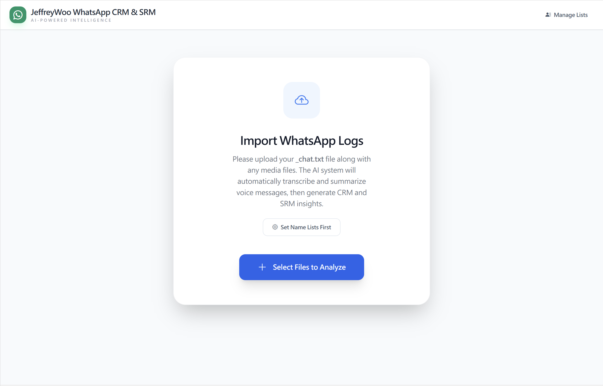
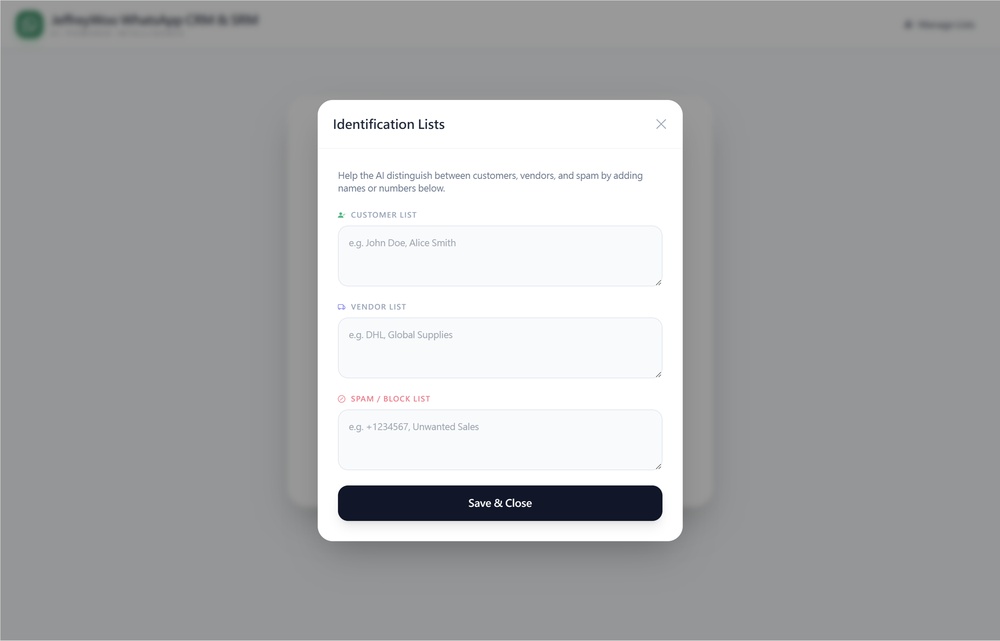

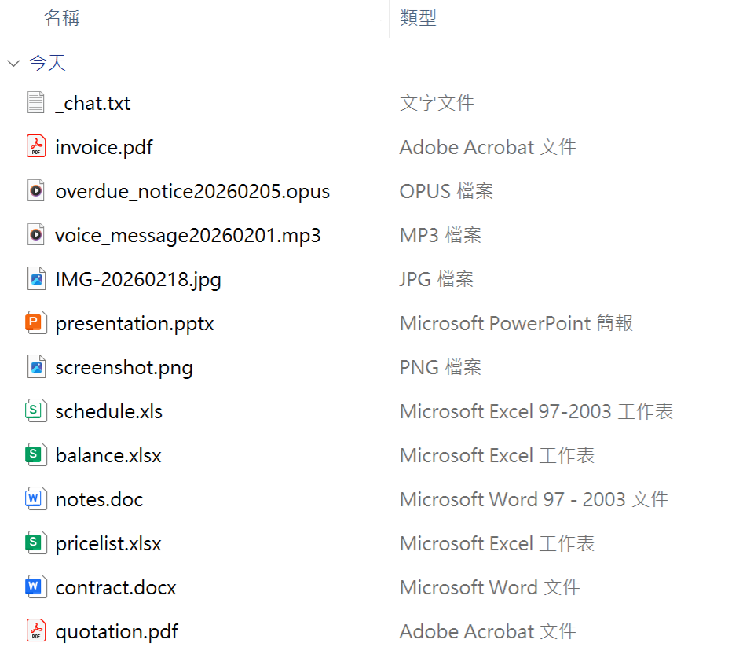
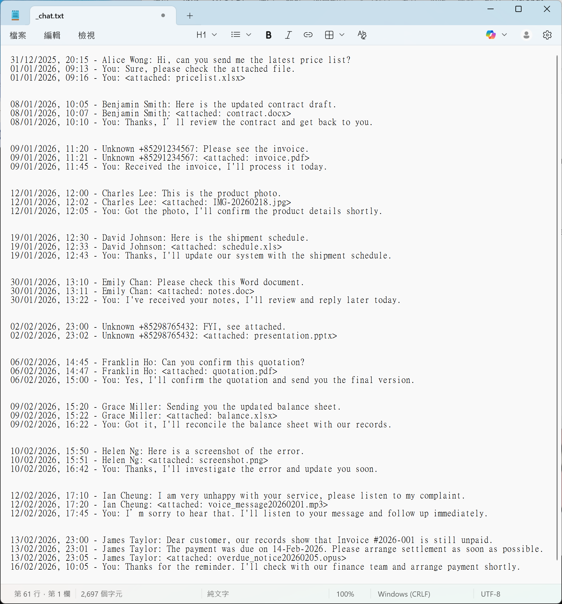
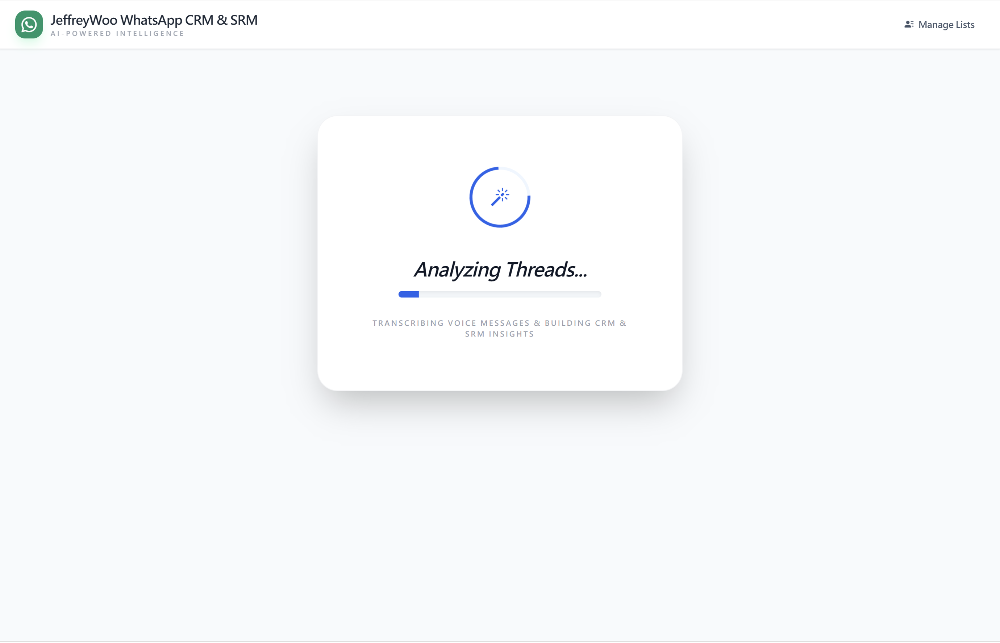

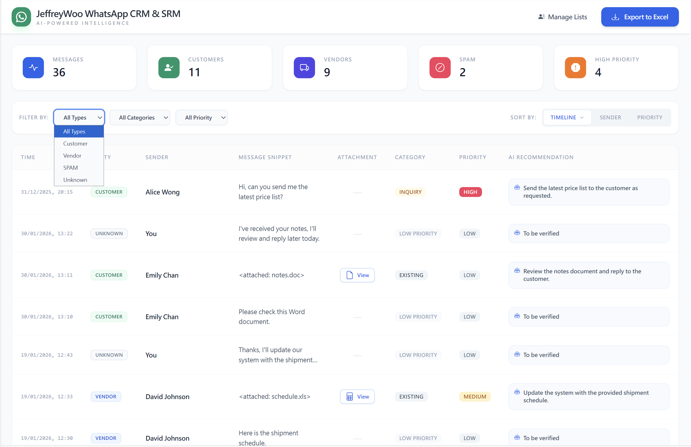
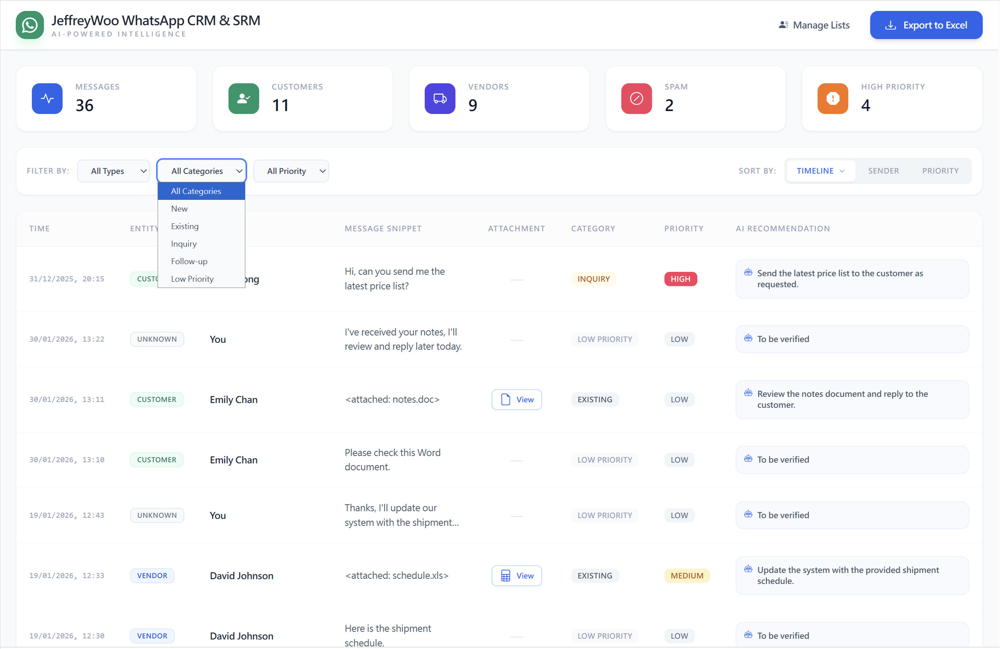
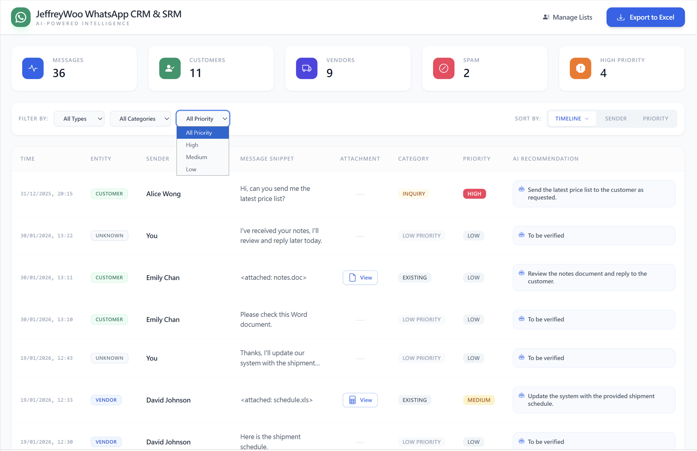
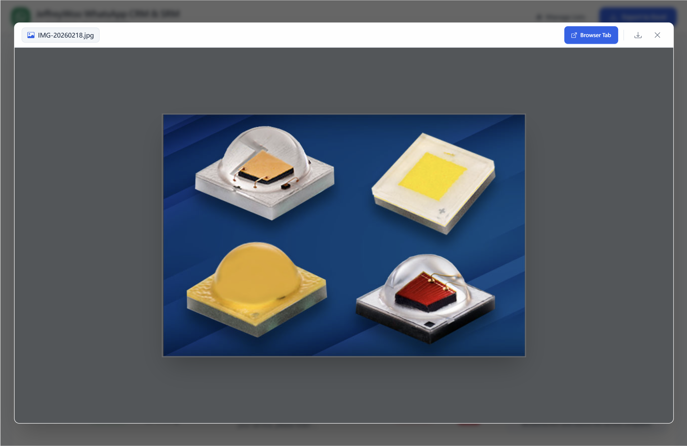
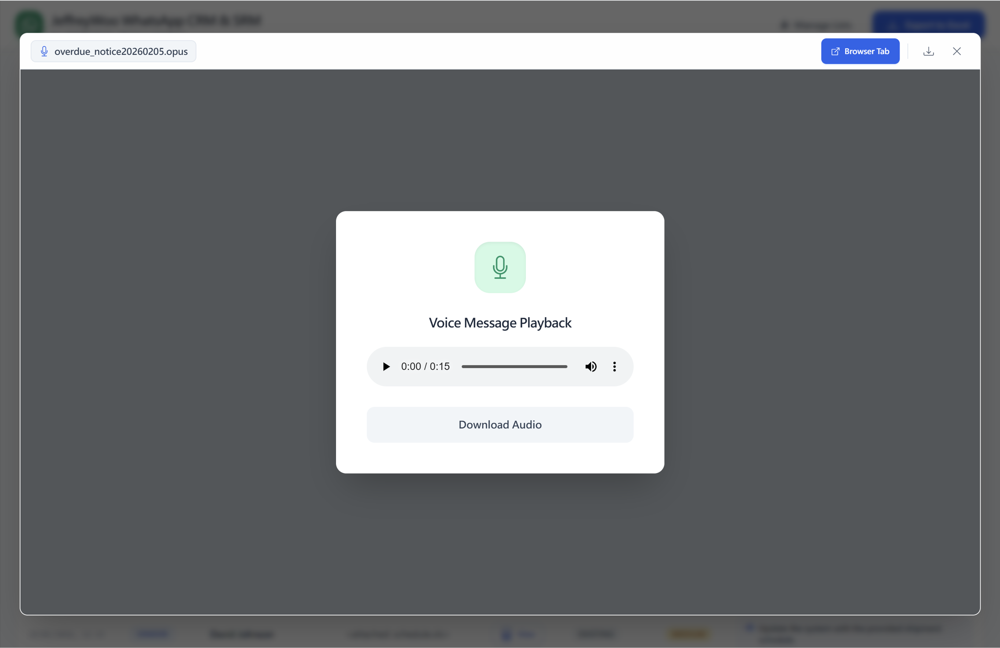
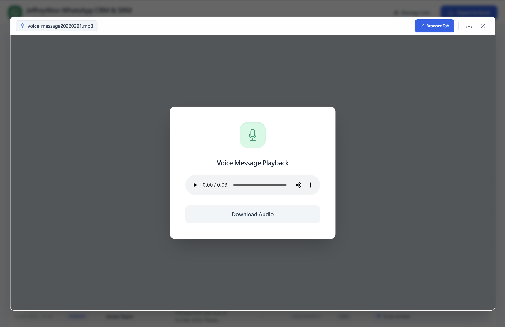
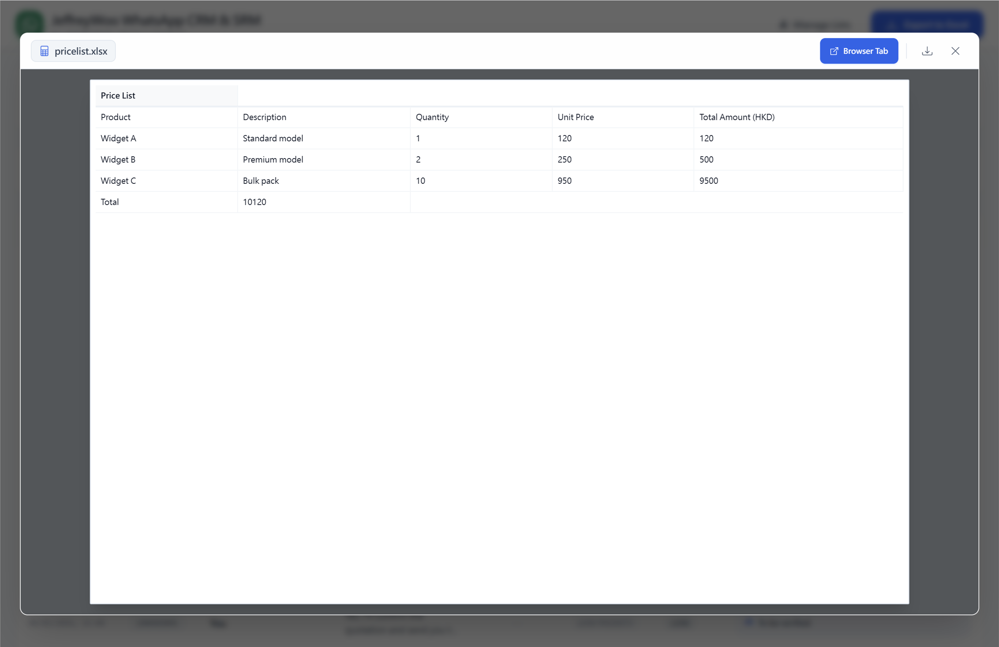
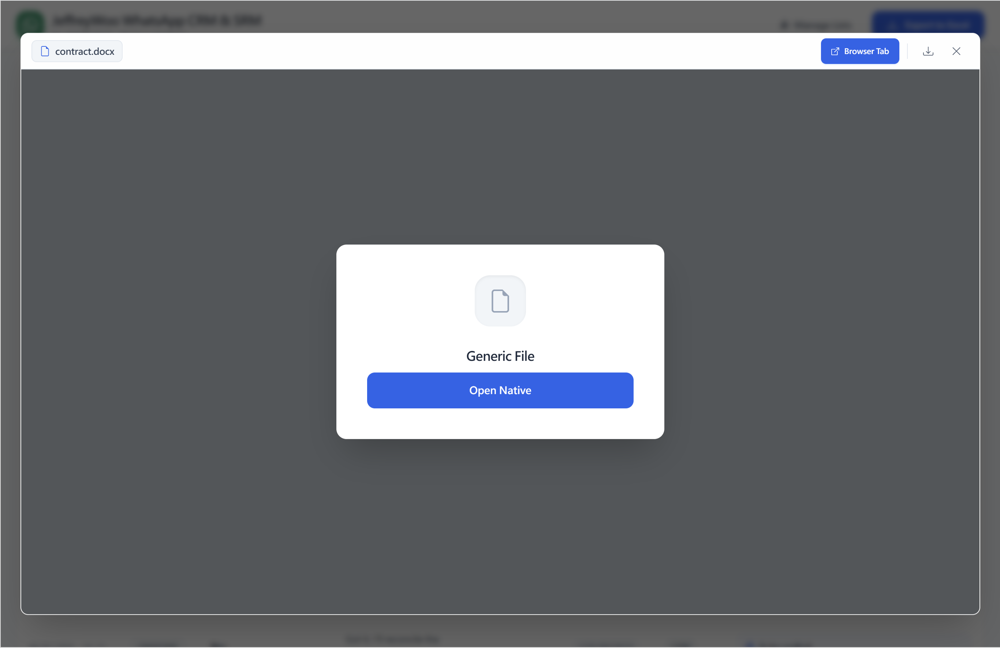
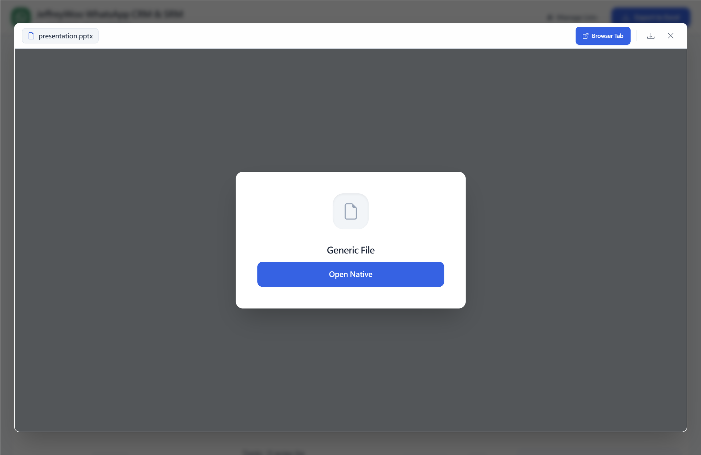
