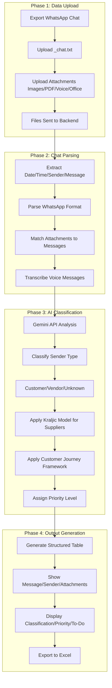

## 📊 Overview

> **Not your typical chat export tool!**

**JeffreyWoo WhatsApp CRM & SRM** is an AI-powered CRM (Customer Relationship Management) & SRM (Supplier Relationship Management) app that transforms raw WhatsApp conversation logs into structured, searchable, and actionable insights for empowering smarter decisions and faster responses.

**Note:** The core architecture of this project is highly scalable. It can be adapted to process data from other instant messaging platforms (e.g., WeChat, Microsoft Teams) and email systems, unlocking similar structured insights from various communication channels.

## ✨ What It Does
- 📂 **Parse Chat Logs** — automatically extract date/time, sender, and message content from `_chat.txt`  
- 📎 **Attachment Matching** — pair messages with voice messages, images, PDFs, Word, Excel, PowerPoint, and other files  
- 🧑‍💼 **Customer/Supplier Classification** — distinguish customers, vendors, and unknown contacts with intelligent tagging, and categorize contacts as new, existing, inquiry, follow-up, low-priority, or spam   
- ⚡ **Priority Sorting** — highlight urgent cases (new inquiries, quotations, contracts, invoices, payments, and complaints) vs. general/low-priority chats
- 🔗 **Attachment Linking** — connect files (voice messages, images, PDFs, Word, Excel, PowerPoint, and other files) directly to the right sender and context, and have a preview function for them
- 📊 **Structured Output** — generate clean tables with all key fields (message, sender, attachments, classification, priority, to-do) and summaries for CRM and SRM workflows, and automatically transcribe and summarize voice messages  
- 📦 **Export Ready** — save results as Excel for reporting, tracking, and integration with other systems  

## 💡Finance Transformation Impact
This project demonstrates how AI reshapes finance workflows by:  
- Converting unstructured WhatsApp communication data into audit‑ready financial intelligence, strengthening internal controls and reducing manual audit effort.  
- Enhancing CRM/SRM with AI‑driven sender classification, enabling real‑time AR/AP, quotation, and contract visibility for stronger cash‑flow and vendor management.  
- Improving operational efficiency through automated prioritization of financial tasks (quotations, invoices, contracts & complaints).  
- Strengthening compliance through automated reporting, attachment linking, and AI transcription to create complete, traceable audit trails.  
- Driving digital transformation by turning the WhatsApp messaging platform into a strategic finance system with AI‑powered AR/AP monitoring and audit‑aligned documentation.

## 🚀 Why Choose WhatsApp CRM & SRM Assistant?
Most tools only export WhatsApp chats. **JeffreyWoo WhatsApp CRM & SRM** goes further — embedding AI-driven classification, attachment handling, and workflow automation to help businesses:  
- Automatically transcribe and summarize voice messages  
- Identify high-priority customers/suppliers instantly  
- Track inquiries, quotations, follow-ups, contracts, invoices, and complaints  
- Reduce manual sorting and improve response times  
- Turn unstructured conversations into actionable CRM/SRM data  

## 💬 CRM/SRM Theories Applied
This app transforms raw WhatsApp chat exports into structured insights for Customer Relationship Management (CRM) and Supplier Relationship Management (SRM). It automates classification, sentiment analysis, and relationship mapping, embedding established CRM/SRM theories into practical workflows:  
- **Customer Lifecycle Management** — The app applies the Customer Journey framework (awareness → consideration → purchase → retention → advocacy) to classify WhatsApp interactions into lifecycle stages.  
- **Relationship Marketing Theory** — Inspired by Berry’s relationship marketing principles, the app identifies trust-building and loyalty signals in conversations, highlighting opportunities for long-term engagement.  
- **Supplier Segmentation Models** — Based on Kraljic’s Portfolio Purchasing Model, the app categorizes suppliers into strategic, leverage, bottleneck, and routine, guiding procurement strategies.  
- **Customer Equity Framework** — AI evaluates value equity, brand equity, and relationship equity from chat data, helping organizations prioritize high-value customers.  
- **Service Quality (SERVQUAL) Model** — The app detects service quality dimensions (reliability, responsiveness, assurance, empathy, tangibles) within WhatsApp exchanges, flagging areas for improvement.  
- **Social Exchange Theory** — Applied to analyze reciprocity and perceived fairness in supplier/customer interactions, supporting sustainable relationship management.  
- **Knowledge Management in CRM** — Conversations are transformed into structured knowledge bases, aligning with CRM theory that emphasizes information sharing for better decision-making.

## 📐Data Flow and Logic Sequence

The following diagram illustrates how the system transforms raw WhatsApp chat exports into structured CRM/SRM intelligence — from file upload through chat parsing, voice transcription, Gemini API classification (applying Customer Lifecycle, Kraljic Model, and Social Exchange Theory), to final Excel export — integrating the relationship management theories described above at each stage.

> **How to read this diagram:** The flow follows 4 phases:
> 1. **Data Upload** — WhatsApp `_chat.txt` + attachments (images, PDFs, voice, Office files)
> 2. **Chat Parsing** — Extract sender, date/time, message; match attachments; transcribe voice
> 3. **AI Classification** — Customer/vendor/supplier classification via Gemini API; apply Kraljic and Customer Journey models
> 4. **Output Generation** — Structured table with priority, to-do items; Excel export

## ⭐ Finance Skills Strengthened
- Full‑stack architecture for AI‑driven financial applications.  
- Secure handling of chat data & financial records, aligned with compliance.  
- AI model integration into real‑world messaging workflows.  
- File parsing & structured data transformation from WhatsApp exports.  
- Dashboards with React (TypeScript + Vite) to deliver finance insights.

## 🤖 Tech Stack
- **Language** — TypeScript, HTML  
- **Framework** — React (with Vite as the build tool)  
- **UI** — Standard React components, styled via TSX
- **Runtime** — Node.js
- 
## 📦 Getting Started
1. Export and upload your WhatsApp chat history (`_chat.txt`) and all related attachments (voice messages, images, PDFs, Word, Excel, PowerPoint, etc.).  
2. Run **JeffreyWoo WhatsApp CRM & SRM** to parse, classify, and match messages with attachments.  
3. Review the generated structured table with customer/supplier classification, priority, and to-do items.  
4. Export results to Excel for further analysis or integration.  

## ⚙️ Run Locally

**Prerequisites:**  Node.js

1. Install dependencies:
   `npm install`
2. Set the `GEMINI_API_KEY` in [.env.local](.env.local) file after you create [.env.local](.env.local) file
3. Run the app:
   `npm run dev`

## 📋 Sample

## References

**1. CRM & SRM Theories**

**Customer Lifecycle Management (The app applies the Customer Journey framework (awareness → consideration → purchase → retention → advocacy) to classify WhatsApp interactions into lifecycle stages)**

- [Kotler, P., & Keller, K. L. (2016). Marketing management (15th ed.). Pearson.](https://dspace.vnbrims.org/items/0c7f6bb2-d512-42bb-ba5a-784329214f18/full)
- [Court, D., Elzinga, D., Mulder, S., & Vetvik, O. J. (2009). The consumer decision journey. McKinsey Quarterly, June 2009.](https://maxket.com/wp-content/uploads/2014/08/theconsumerdecisionjourney-110105124644-phpapp02.pdf)

**Relationship Marketing Theory (the app identifies trust-building and loyalty signals in conversations, highlighting opportunities for long-term engagement)**

- [Berry, L. L. (1983). Relationship marketing. In L. L. Berry, G. L. Shostack, & G. D. Upah (Eds.), Emerging perspectives on services marketing (pp. 25–28). American Marketing Association.](https://books.google.com.hk/books/about/Emerging_Perspectives_on_Services_Market.html?id=bQgpAQAAMAAJ&redir_esc=y)
- [Morgan, R. M., & Hunt, S. D. (1994). The commitment-trust theory of relationship marketing. Journal of Marketing, 58(3), 20–38.](https://www.researchgate.net/publication/233894851_The_Commitment-Trust_Theory_of_Relationship_Marketing)

**Supplier Segmentation (Kraljic's Portfolio Purchasing Model, categorizing suppliers into strategic, leverage, bottleneck, and routine quadrants, guiding procurement strategies based on profit impact and supply risk)**

- [Kraljic, P. (1983). Purchasing must become supply management. Harvard Business Review, 61(5), 109–117.](https://www.abaspro.com.ar/wp-content/uploads/2019/05/Kraljic.pdf)

**Customer Equity Framework (AI evaluates value equity, brand equity, and relationship equity from chat data, helping organizations prioritize high-value customers)**

- [Rust, R. T., Zeithaml, V. A., & Lemon, K. N. (2000). Driving customer equity: How customer lifetime value is reshaping corporate strategy. The Free Press.](https://www.researchgate.net/publication/280726122_Driving_Customer_Equity_How_Customer_Lifetime_Value_Is_Reshaping_Corporate_Strategy20021Roland_T_Rust_Valarie_Zeithaml_Katherine_N_Lemon_Driving_Customer_Equity_How_Customer_Lifetime_Value_Is_Reshapin)

**Service Quality (SERVQUAL) Model (with service quality dimensions (reliability, responsiveness, assurance, empathy, tangibles) within WhatsApp exchanges, flagging areas for improvement)**

- [Parasuraman, A., Zeithaml, V. A., & Berry, L. L. (1988). SERVQUAL: A multiple-item scale for measuring consumer perceptions of service quality. Journal of Retailing, 64(1), 12–40.](https://www.researchgate.net/publication/200827786_SERVQUAL_A_Multiple-item_Scale_for_Measuring_Consumer_Perceptions_of_Service_Quality)

**Social Exchange Theory (Applied to analyze reciprocity and perceived fairness in supplier/customer interactions, supporting sustainable relationship management)**

- [Homans, G. C. (1958). Social behavior as exchange. American Journal of Sociology, 63(6), 597–606.](https://web.ics.purdue.edu/~hoganr/SOC%20602/Spring%202014/Homans%201958.pdf)
- [Blau, P. M. (1964). Exchange and power in social life. John Wiley & Sons.](https://ia801700.us.archive.org/6/items/in.ernet.dli.2015.118920/2015.118920.Exchange-And-Power-In-Social-Life_text.pdf)

**Knowledge Management in CRM (Conversations are transformed into structured knowledge bases, aligning with CRM theory that emphasizes information sharing for better decision-making)**

- [Nonaka, I., & Takeuchi, H. (1995). The knowledge-creating company: How Japanese companies create the dynamics of innovation. Oxford University Press.](https://www.researchgate.net/publication/384316693_The_knowledge-creating_company_How_Japanese_companies_create_the_dynamics_of_innovation_by_Nonaka_Ikujiro_Takeuchi_Hirotaka_New_York_Oxford_University_Press_1995_284_pp_1939_Hardcover_740_paperback_IS)

**2. Technology Stack**

**Gemini API (AI-powered classification – classifies sender type (customer/vendor/unknown), applies Kraljic Model for suppliers, applies Customer Journey Framework, and assigns priority levels)**

- [Gemini Team, Google. Gemini API.](https://ai.google.dev/gemini-api/docs)

**React (with Vite) & TypeScript (Interactive dashboards displaying structured tables with message, sender, attachments, classification, priority, and to-do items)**

- [Biasi, B. Vite: Next Generation Frontend Tooling.](https://vite.dev/)
- [Facebook Open Source. React: The Library for Web and Native User Interfaces.](https://github.com/facebook/react)

**Node.js Runtime (Backend runtime environment for the application)**

- [Node.js Foundation. Node.js® JavaScript Runtime.](https://nodejs.org/)

**WhatsApp Chat Format (extracting date/time, sender, and message content, and matches attachments to messages)**

- [WhatsApp LLC. (2024). Export chat history from WhatsApp.](https://faq.whatsapp.com/1180414079177245/)

## ⚖️ Disclaimer
**JeffreyWoo WhatsApp CRM & SRM** provides AI-driven insights for informational, educational, and demonstration purposes only. It does not replace professional CRM/SRM platforms or guarantee financial, legal, or contractual outcomes. It does not constitute professional advice of any kind, including but not limited to legal, financial, medical, or relationship advice.

The AI‑generated responses and interactions are produced by machine learning models and may be inaccurate, inappropriate, or offensive. The app is not intended to replace human judgment or professional services.

Users should validate outputs before making business-critical decisions. The developer assumes no liability for any damages, misunderstandings, or harms arising from the use of this software.

Use at your own risk.

## 📄 License

**GNU Affero General Public License v3.0 (AGPL‑3.0)** — JeffreyWoo WhatsApp CRM & SRM

- ✅ You are free to use, modify, and distribute this software, provided that any derivative works are also licensed under AGPL‑3.0.
- ✅ If you run or deploy this software over a network (e.g., as a web service), you must make the source code of your modified version available to all users who interact with it.
- ✅ This ensures transparency, collaboration, and continued open‑source availability of improvements.
- ❌ The software is provided “as is”, without warranties of any kind.

For full details, see the [LICENSE](./LICENSE) file.

## 👤 About the Author
Jeffrey Woo — Finance Manager | Strategic FP&A, AI Automation & Cost Optimization | MBA | FCCA | CTA | FTIHK | SAP Financial Accounting (FI) Certified Application Associate | Xero Advisor Certified

📧 Email: jeffreywoocf@gmail.com  
💼 LinkedIn: https://www.linkedin.com/in/wcfjeffrey/  
🐙 GitHub: https://github.com/wcfjeffrey/
